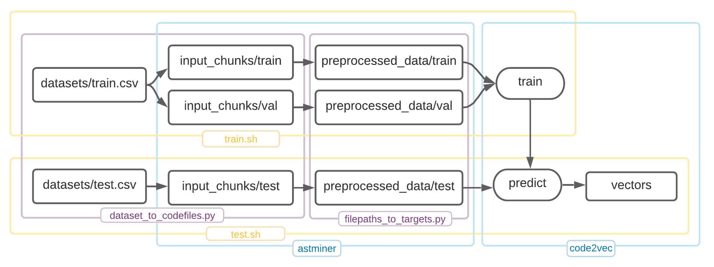

# pycode2vec

Custom [code2vec](https://github.com/tech-srl/code2vec) implementation for Python3. Uses path-miner from [astminer](https://github.com/JetBrains-Research/astminer) project.

## Usage

### Before the first launch

1. Run `./gradlew shadowJar` in `astminer` directory 

### Training

1. Place `train.csv` containing the `code_block` and `target` columns in the `dataset` folder
2. Run `train.sh --nthreads N` (by default, the number of threads is -1)

### Predicting

1. Place `test.csv` containing the `code_block` and `target` columns in the `dataset` folder
2. Run `predict.sh`
3. Check out `vectors` folder to get the calculated vectors

Configurations can be found in `default.config`.

[comment]: <> (where `01` is a dataset name assigned in `train.sh`. Rename DATASET_NAME variable there, if you want to run `preprocess.py` for new data keeping)

The [original work](https://github.com/tech-srl/code2vec) has a lot more opportunities (including already trained models for Java code chunks). It is strongly recommended to get acquainted with it.

## FAQ

#### Differences between code vectors and target embeddings

The code vectors and the target embeddings are trained to be close to each other, but they are different. Target embeddings are weights vectors between the code vector and the softmax layer. The vector of a specific method name (e.g., `sort`) is shared among all the methods that are labeled as `sort`, whereas the code vector of each of these examples is slightly different than the others. During training, the softmax (+ cross-entropy loss) encourages the code vector to have a large value of dot-product with the "correct" target embedding (the target embedding of the true label), and a low dot-product with each of the rest of the target embeddings. So eventually, it makes the code vector its corresponding true-target embedding be close to each other in the euclidean space. This is a characteristic of softmax+cross entropy which is not specific to code2vec.

